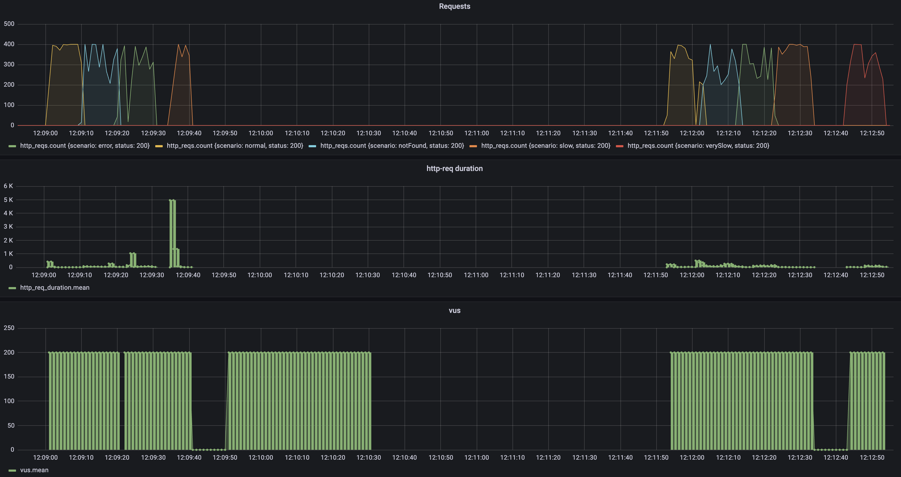

# Similar Products API

REST API to retrieve products similar to a given product, built with Spring Boot.

The API requirements and design can be found [here](./proposal/readme.md).

## Main Features
- Endpoint to query similar products for a given product.
- Centralized exception handling.
- Interactive documentation with Swagger-UI.
- Unit and integration tests with JUnit, Mockito, and MockMvc.

## Requirements
- Java 17+
- Maven 3.8+

## Getting Started
Before running the application, make sure to execute `mvn clean install` to build the project. 
This will download all dependencies and generate any necessary code automatically.
## API Usage

### Get similar products

```http
GET /product/{productId}/similar
```

Example:
```bash
curl 'http://localhost:8080/product/1/similar'
```

Response:
```json
[
  {
    "id": "2",
    "name": "Dress",
    "price": 19.99,
    "availability": true
  },
  ...
]
```

## Swagger Documentation

Access the interactive documentation at:

- [http://localhost:8080/swagger-ui.html](http://localhost:8080/swagger-ui.html)

## Endpoint performance



```
    data_received..............: 3.3 MB 37 kB/s
    data_sent..................: 1.2 MB 14 kB/s
    http_req_blocked...........: avg=3.11ms   min=7µs      med=591µs    max=358.47ms p(90)=1.6ms    p(95)=3.5ms   
    http_req_connecting........: avg=834.35µs min=0s       med=0s       max=152.52ms p(90)=0s       p(95)=0s      
    http_req_duration..........: avg=132.87ms min=413µs    med=15.71ms  max=6.03s    p(90)=153.37ms p(95)=305.78ms
    http_req_receiving.........: avg=3.29ms   min=26µs     med=1.35ms   max=409.01ms p(90)=4.71ms   p(95)=9.32ms  
    http_req_sending...........: avg=6.4ms    min=11µs     med=701µs    max=598.63ms p(90)=18.93ms  p(95)=32.79ms 
    http_req_tls_handshaking...: avg=0s       min=0s       med=0s       max=0s       p(90)=0s       p(95)=0s      
    http_req_waiting...........: avg=123.17ms min=361µs    med=10.19ms  max=6.03s    p(90)=126.01ms p(95)=256.47ms
    http_reqs..................: 12169  135.01719/s
    iteration_duration.........: avg=656.08ms min=500.76ms med=528.02ms max=6.54s    p(90)=712.32ms p(95)=881.38ms
    iterations.................: 11581  128.493227/s
    vus........................: 200    min=0   max=200
    vus_max....................: 200    min=200 max=200
```
